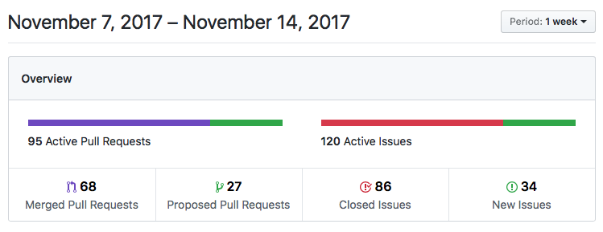
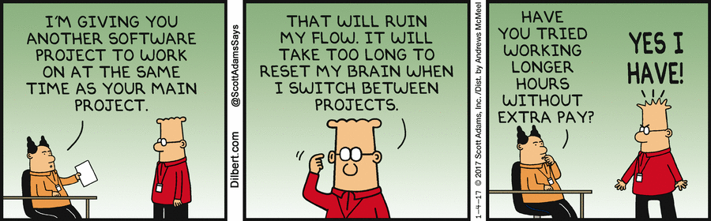
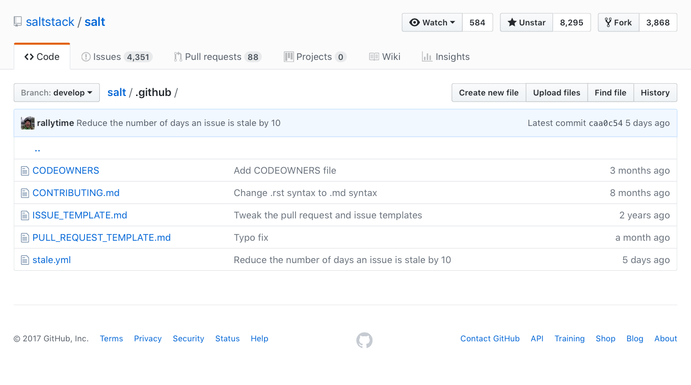
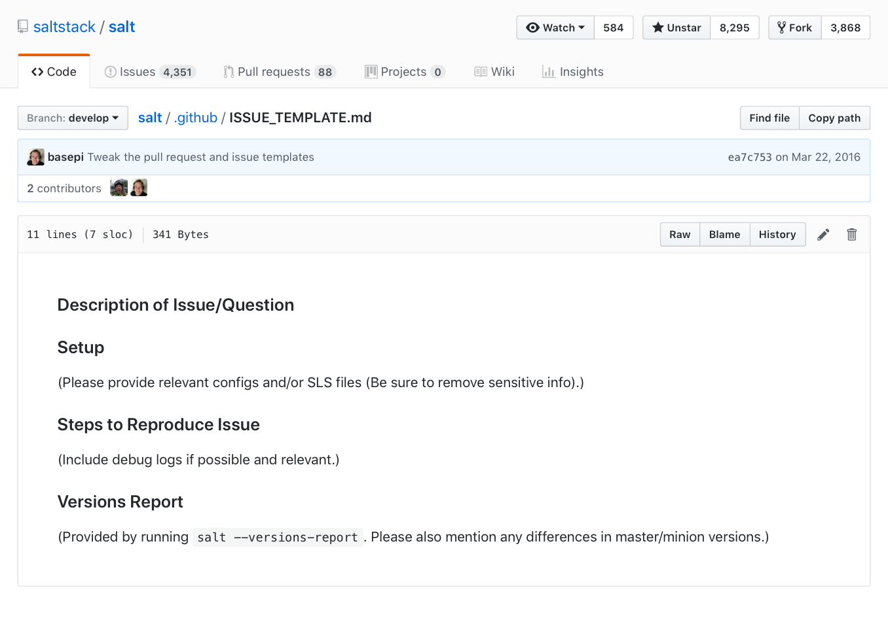
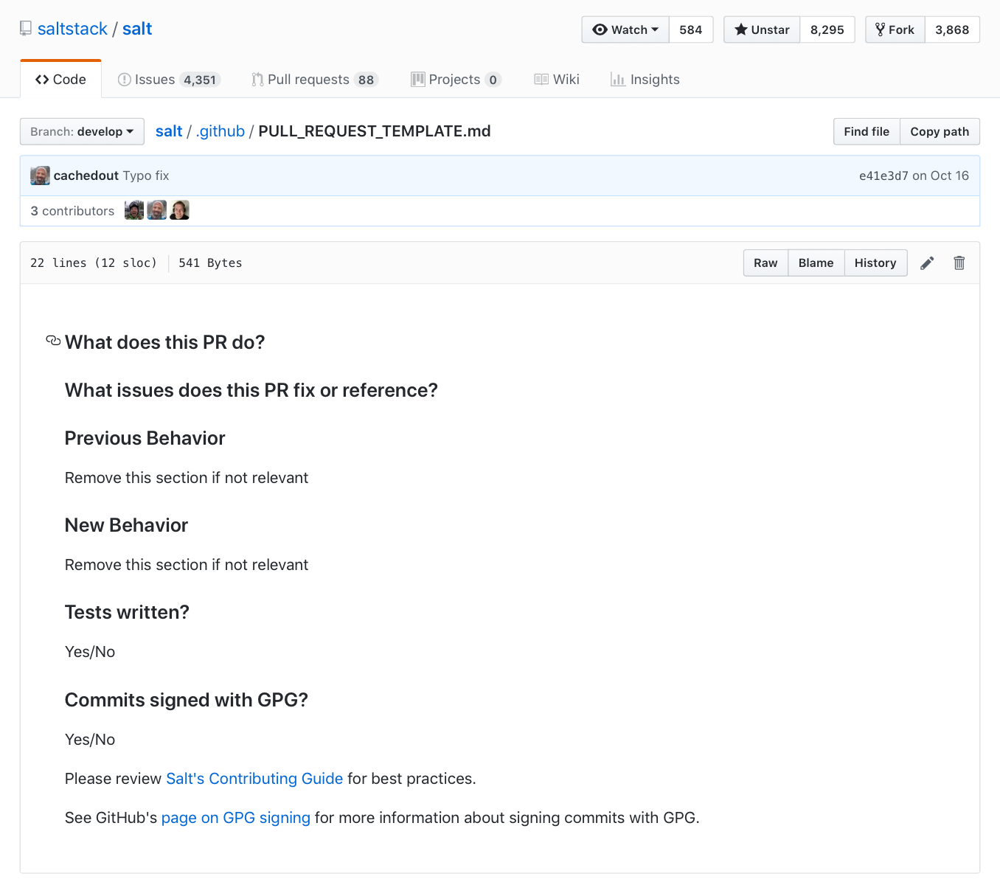
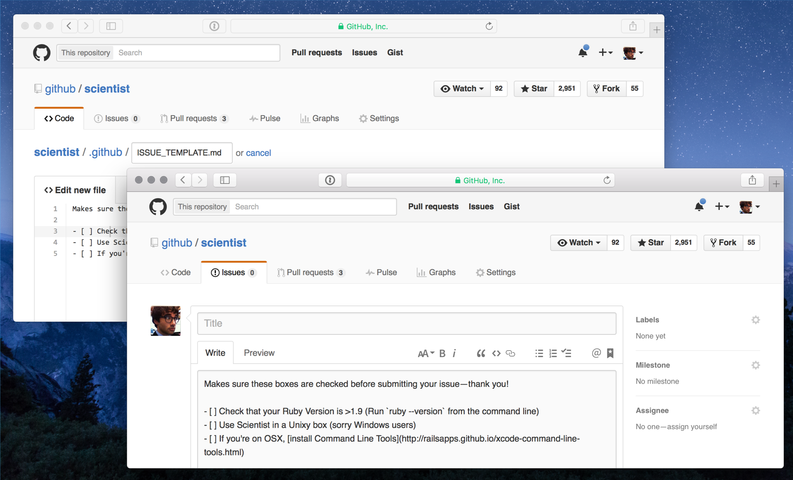
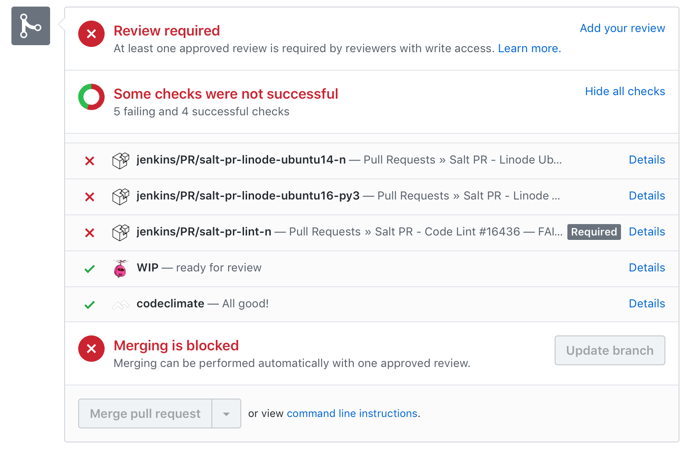
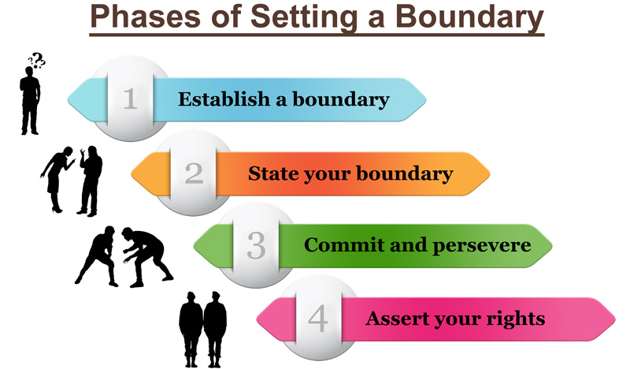

## Open Source Communities

### Interrupt-Driven-Development

Colton Myers

@basepi

Software Engineer, DMa Security Services

---

## Who Am I?

### @basepi

* Co-Creator and Maintainer of HubbleStack
* Previously: Core Engineer at SaltStack
* Author of _Learning SaltStack_

---

## HubbleStack

* Open Source Security Compliance Software
* Built on SaltStack as a library
* One Adobe solution for security compliance (replacing CloudPassage)
* hubblestack.io

---

## HubbleStack

* Silent user community
* Not hugely active developer community
* Still lessons to be learned

---

## SaltStack

* Open source config management
* ~2000 contributors
* 87,000 commits
* 45,000 combined pull requests and issues

---

## SaltStack



---

### Let's Talk About Context-Switching



---

# 2%

---

### But wait, I'm part of the 2%!

---

### Context-switching hurts your productivity

---

### Open Source community-management is a context-switching nightmare

---

### We're Doomed!


---

### Issue/PR Templates



---



---



---



---

### Filters

---

### Filters

```
from:(notifications@github.com)
```

---

### Filters

```
from:(notifications@github.com) to:(colton.myers@gmail.com)
```

---

### Filters

```
list:"hubblestack/hubble <hubble.hubblestack.github.com>"
```

---

### Filters

```
"You can view, comment on, or merge this pull request online at"
```

Not perfect, but pretty close

---

### Test Integrations



---

### But most importantly...

---

### Boundaries



---

# Boundaries

---

# Questions?

Colton Myers

@basepi

slides.basepi.net/idd

---

# Thanks!

Colton Myers

@basepi

slides.basepi.net/idd
